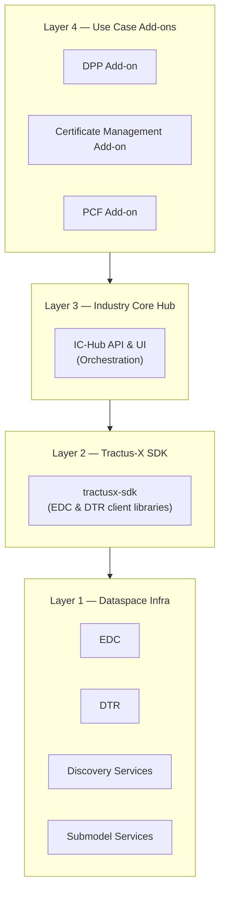
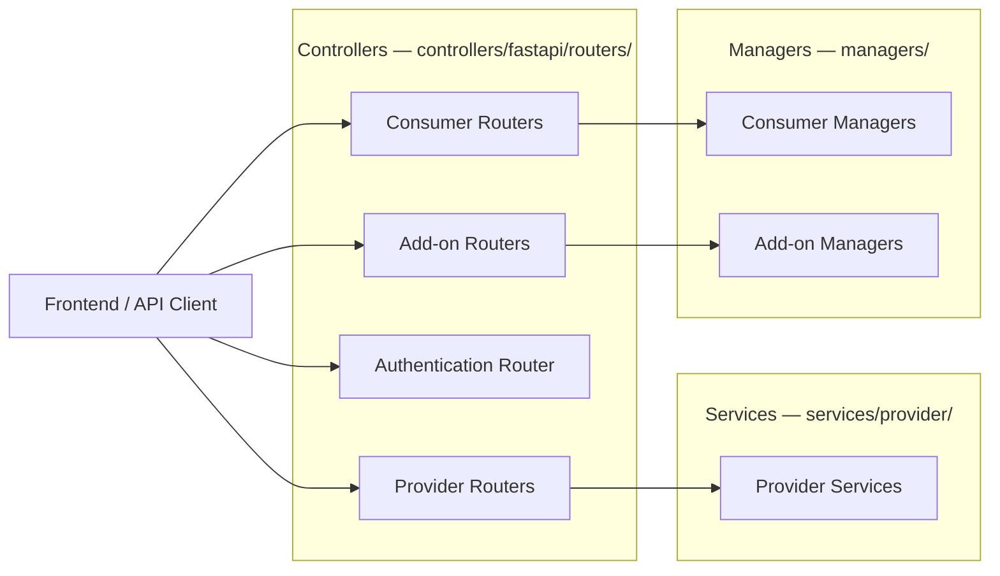
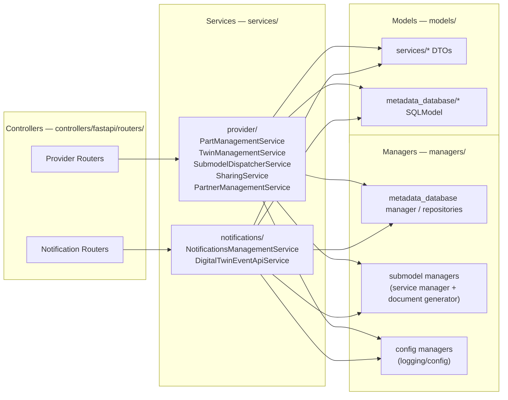
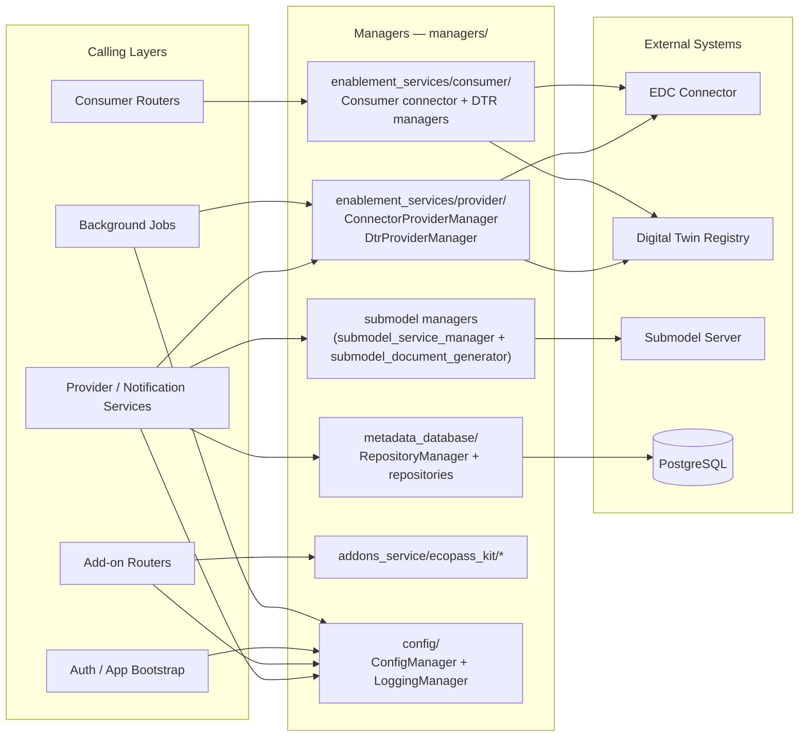
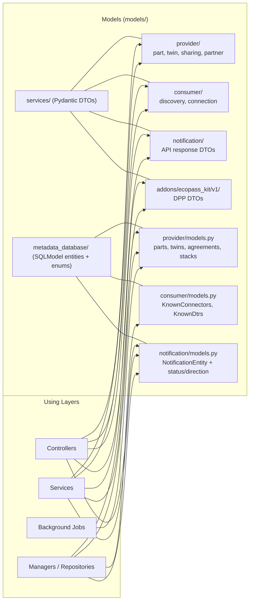
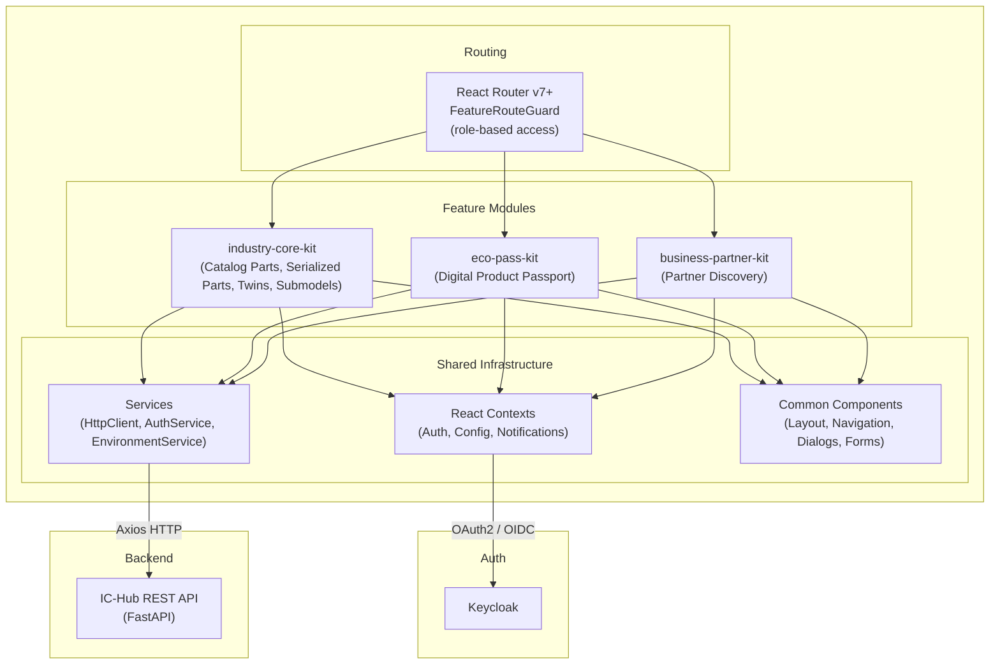
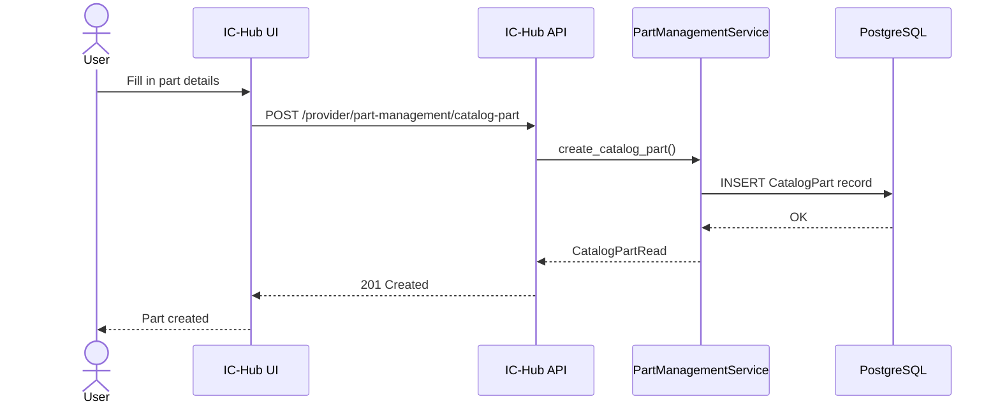
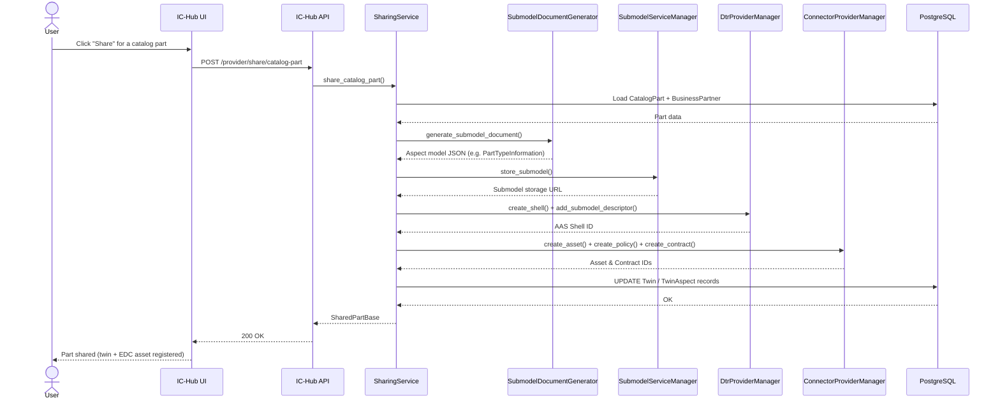

[![Contributors][contributors-shield]][contributors-url]
[![Stargazers][stars-shield]][stars-url]
[![Apache 2.0 License][license-shield]][license-url-code]
[![CC-BY-4.0][license-shield-non-code]][license-url-non-code]
[![Latest Release][release-shield]][release-url]

[](https://github.com/eclipse-tractusx/tractusx-sdk)

<p align="center">
  
</p>

<h1 align="center">Industry Core Hub</h1>

<p align="center">
  A lightweight open-source <strong>data provision and consumption orchestrator</strong> for the Catena-X dataspace.<br/>
  It helps teams go from onboarding to first data exchange in days, not months.
</p>

---

## Table of Contents

- [Table of Contents](#table-of-contents)
- [What is the Industry Core Hub?](#what-is-the-industry-core-hub)
  - [The Problem It Solves](#the-problem-it-solves)
  - [The Solution](#the-solution)
  - [Who is it for?](#who-is-it-for)
- [Key Capabilities](#key-capabilities)
  - [Data Provisioning](#data-provisioning)
  - [Data Consumption](#data-consumption)
  - [Platform \& Operations](#platform--operations)
- [Architecture](#architecture)
  - [High-Level System Context](#high-level-system-context)
  - [Building Blocks](#building-blocks)
  - [Backend](#backend)
  - [Frontend](#frontend)
  - [Data Provision Flow](#data-provision-flow)
- [Technology Stack](#technology-stack)
- [Catena-X Standards](#catena-x-standards)
- [Integrated Services](#integrated-services)
- [Roadmap](#roadmap)
- [Installation](#installation)
  - [Quick Start (Local Development)](#quick-start-local-development)
  - [Kubernetes / Helm](#kubernetes--helm)
  - [Local Umbrella (Tractus-X Components)](#local-umbrella-tractus-x-components)
- [Documentation](#documentation)
- [KIT Add-on Extensions](#kit-add-on-extensions)
  - [Available and Planned Add-ons](#available-and-planned-add-ons)
- [How to Get Involved](#how-to-get-involved)
- [Reporting a Bug or Sharing an Idea](#reporting-a-bug-or-sharing-an-idea)
- [Reporting a Security Issue](#reporting-a-security-issue)
- [Licenses](#licenses)
- [NOTICE](#notice)

---

## What is the Industry Core Hub?

The **Industry Core Hub (IC-Hub)** is an open-source reference implementation of the [Eclipse Tractus-X Industry Core KIT](https://eclipse-tractusx.github.io/docs-kits/category/industry-core-kit). It acts as a **middleware orchestrator** that sits between your business applications/backend & legacy systems and the underlying Eclipse Tractus-X dataspace infrastructure, eliminating the need for deep expertise in each individual component.

### The Problem It Solves

Adopting dataspace technologies from Eclipse Tractus-X (used for example in the Catena-X dataspace by service providers) typically requires integrating multiple complex components:

- The **Eclipse Dataspace Connector (EDC)** for sovereign data exchange
- The **Digital Twin Registry (DTR)** for managing Asset Administration Shell (AAS) digital twins
- **Discovery Services** for finding business partners' endpoints

Setting all of this up correctly — with the right policies, asset registrations, and data contracts — is a significant engineering effort that can take weeks or months, and requires specialist knowledge most companies don't have in-house.

### The Solution

The IC-Hub abstracts all of this complexity behind a clean, unified API and an intuitive user interface. You interact with one system; the IC-Hub orchestrates everything else for you:

- Register a **digital twin** for a part → the IC-Hub creates the AAS shell in the DTR, registers the EDC asset, and sets up the access policies automatically.
- Attach a **submodel** (e.g., a Digital Product Passport) → the IC-Hub stores the data and exposes it as a standard-compliant EDC-protected endpoint.
- **Consume data** from a business partner → the IC-Hub discovers the partner's endpoints, negotiates the EDC data contract, and retrieves the submodel data — all transparently.

This dramatically reduces the onboarding effort for **SMEs and use case developers**, turning weeks of integration work into a matter of days.

### Who is it for?

| Audience | Benefit |
|---|---|
| **Data Providers** | Register automotive parts, create digital twins, attach submodels, and share data with supply chain partners with minimal effort |
| **Data Consumers** | Search, discover, and retrieve digital twin data from business partners without dealing with EDC negotiation complexity |
| **Use Case Developers** | Build Catena-X use cases (e.g., DPP, Traceability) on top of a stable, pre-integrated foundation in days rather than months |
| **SMEs** | Adopt the Catena-X dataspace with minimal IT investment and infrastructure knowledge |
| **KIT Providers** | Extend the IC-Hub with custom add-on views and features for specific use cases, distributable via the Catena-X marketplace |

---

## Key Capabilities

### Data Provisioning

- **Create, read, update, and delete digital twins** (Part Type / Part Instance) in the Digital Twin Registry
- **Register submodels** of any type — including generic JSON, Industry Core models (SerialPart, Batch, JustInSequencePart), and use-case-specific models like the Digital Product Passport (DPP)
- **Automatic EDC asset and policy registration** for each submodel — no manual EDC management required
- **Bill of Materials (BoM) submodel support** — link parent parts to supplier twins across company boundaries
- **Bulk and manual data input** — upload data via the UI or integrate programmatically via the REST API

### Data Consumption

- **Discover business partners** via the Catena-X Discovery Services (Discovery Finder → BPN Discovery → EDC Discovery)
- **Negotiate EDC data contracts** automatically and retrieve submodel data from partner systems
- **Browse and inspect** digital twins and all associated submodels from any Catena-X participant

### Platform & Operations

- **Keycloak-based authentication and authorization** — role-based access control out of the box
- **Helm chart deployment** for Kubernetes clusters, with optional bundled EDC and DTR
- **OpenAPI-documented REST backend** (FastAPI/Python) with Swagger UI
- **React/MUI frontend** with a clean, intuitive interface
- **Extensible add-on architecture** — add custom views and features per KIT use case

---

## Architecture

### High-Level System Context

The IC-Hub acts as the central orchestration layer between your applications and the Catena-X dataspace components. Instead of integrating with each component individually, your application talks only to the IC-Hub.

```mermaid
%%{init: {"flowchart": {"subGraphTitleMargin": {"top": 24, "bottom": 12, "defaultRenderer": "elk"}}}}%%
flowchart TB
    subgraph "Your Organization"
        BACK["Backend<br/>Legacy System"]
        PIP["Integration Pipeline"]
        APP["Business Application UI"]
        ICH["Industry Core Hub"]
        DB[("PostgreSQL Metadata DB")]
        KC["Keycloak IAM"]
    end

    subgraph "Tractus&#8209;X&nbsp;Dataspace&nbsp;Components<br/>(Self&#8209;hosted&nbsp;or&nbsp;as&nbsp;a&nbsp;Service)"
        direction TB
        %% This creates an invisible spacer to push real nodes down
        spacer1[" "]
        spacer1[" "]
        spacer1[" "]
        style spacer1 fill:transparent,stroke:none,color:transparent,height:20px
        EDC["EDC"]
        DTR["DTR"]
        SS["Submodel Server"]
    end

    subgraph "Tractus&#8209;X&nbsp;Discovery&nbsp;Services"
        direction TB
        %% This creates an invisible spacer to push real nodes down
        spacer1[" "]
        style spacer1 fill:transparent,stroke:none,color:transparent,height:20px
        DF["Discovery Finder"]
        BPND["BPN Discovery"]
        EDCD["EDC Discovery"]
    end

    subgraph "Business Partner"
        direction TB
        %% This creates an invisible spacer to push real nodes down
        spacer1[" "]
        style spacer1 fill:transparent,stroke:none,color:transparent,height:20px
        PEDC["EDC"]
        PDTR["DTR"]
    end

    APP -- "REST API / UI" --> ICH
    ICH --> DB
    ICH -- "Asset & Policy<br/>Registration" --> EDC
    ICH -- "AAS Twin<br/>Registration" --> DTR
    ICH -- "Submodel Read/Write" --> SS
    ICH -- "Endpoint Discovery" --> DF
    DF --> BPND
    DF --> EDCD
    BACK --> PIP
    PIP -- "REST API" --> ICH
    ICH -- "Auth" --> KC
    EDC <-- "Data Contract<br/>Negotiation" --> PEDC
    PEDC --> PDTR
```



The architecture follows a layered abstraction approach — each layer hides the complexity of the layer below it, so use-case developers only interact with high-level business concepts.



For the full architecture documentation, see the [Architecture Guide](./docs/architecture/README.md).

### Building Blocks

The IC-Hub integrates with these core Catena-X / Tractus-X components:

| Component | Role |
|---|---|
| [Tractus-X EDC](https://github.com/eclipse-tractusx/tractusx-edc) | Sovereign data exchange via standardized data contracts |
| [Digital Twin Registry (DTR)](https://github.com/eclipse-tractusx/sldt-digital-twin-registry) | AAS-compliant digital twin registration and discovery |
| [Submodel Server](https://github.com/eclipse-tractusx/tractus-x-umbrella/tree/main/simple-data-backend) | Storage and serving of aspect model data |
| [Discovery Finder](https://github.com/eclipse-tractusx/sldt-discovery-finder) | Locates BPN Discovery endpoints for a given asset type |
| [BPN Discovery](https://github.com/eclipse-tractusx/sldt-bpn-discovery) | Maps manufacturer part IDs to Business Partner Numbers |
| [Portal IAM / Keycloak](https://github.com/eclipse-tractusx/portal-iam) | Identity and access management |

### Backend

The backend exposes a RESTful API (documented via Swagger/OpenAPI) that orchestrates all interactions with the Catena-X components. It is built with **Python and FastAPI**, uses **SQLModel/PostgreSQL** for metadata persistence, and integrates with the [Tractus-X SDK](https://github.com/eclipse-tractusx/tractusx-sdk).

```mermaid
%%{init: {"flowchart": {"subGraphTitleMargin": {"top": 24, "bottom": 12}}}}%%
graph TB
    CLIENT["Frontend / API Client"]
    JOBS["Background Jobs<br/>(asset_sync_job)"]

    subgraph CTRL["Controllers — controllers/fastapi/routers/"]
        R_PROV["Provider Routers<br/>/part-management<br/>/twin-management<br/>/submodel-dispatcher<br/>/share<br/>/partner-management"]
        R_CONS["Consumer Routers<br/>/discover<br/>/connection"]
        R_AUTH["Authentication Router"]
        R_ADDON["Add-on Routers<br/>/addons/ecopass-kit"]
    end

    subgraph SVC["Services — services/provider/"]
        PS["PartManagementService"]
        TMS["TwinManagementService"]
        SMS["SubmodelDispatcherService"]
        SHS["SharingService"]
        PMS["PartnerManagementService"]
    end

    subgraph MGR["Managers — managers/"]
        subgraph PROV_MGR["enablement_services/provider/"]
            CPM["ConnectorProviderManager<br/>(EDC asset & policy registration)"]
            DPM["DtrProviderManager<br/>(AAS Shell registration)"]
        end
        subgraph CONS_MGR["enablement_services/consumer/"]
            CCM["ConsumerConnectorManager<br/>(EDC contract negotiation)"]
            DCM["DtrConsumerManager<br/>(AAS Shell discovery)"]
        end
        SVM["SubmodelServiceManager<br/>(FileSystem / HTTP adapter)"]
        SDG["SubmodelDocumentGenerator<br/>(aspect model documents)"]
        DB_M["RepositoryManager<br/>(SQLModel ORM)"]
        ADDON_MGR["addons_service/ecopass_kit<br/>(EcoPass KIT managers)"]
    end

    subgraph MODELS["Models — models/"]
        SVC_M["services/<br/>Pydantic DTOs (provider & consumer)"]
        DB_MDL["metadata_database/<br/>SQLModel ORM models (provider & consumer)"]
    end

    subgraph EXT["External Systems"]
        EDC["EDC Connector<br/>(Tractus-X SDK)"]
        DTR["Digital Twin Registry<br/>(Tractus-X SDK)"]
        SS["Submodel Server<br/>(FileSystem or HTTP)"]
        PG[("PostgreSQL")]
    end

    CLIENT --> R_PROV & R_CONS & R_AUTH & R_ADDON
    JOBS --> CPM & DPM & DB_M

    %% Provider path: routers → services → managers
    R_PROV --> PS & TMS & SMS & SHS & PMS
    PS & TMS & SMS & SHS & PMS --> CPM & DPM & SVM & SDG & DB_M

    %% Consumer path: routers call managers directly (no services/consumer/ layer)
    R_CONS --> CCM & DCM

    %% Add-on path: routers call addon managers directly (no services layer)
    R_ADDON --> ADDON_MGR
    ADDON_MGR --> SVM & DB_M

    %% Background jobs also call managers directly (no services layer)
    %% (see jobs/asset_sync_job.py)

    %% Models used across layers
    SVC_M -. "used by" .-> SVC
    DB_MDL -. "used by" .-> MGR

    CPM & DPM --> EDC & DTR
    CCM & DCM --> EDC & DTR
    SVM --> SS
    DB_M --> PG
```


The backend is organized into the following packages:
- **`controllers/`** — FastAPI routers exposing the REST API endpoints (provider, consumer, authentication, add-ons) (see the focused controllers view below for more detail in the relations of this package).
- **`services/provider/`** — Business logic for the provider path, independent of the exposing technology; orchestrates the managers (see the focused services view below for controller, manager, and model relations)
- **`managers/`** — Low-level wrappers around external systems and the metadata database (see the focused managers view below for calling layers and external system relations):
  - `enablement_services/provider/` — `ConnectorProviderManager` (EDC), `DtrProviderManager` (DTR)
  - `enablement_services/consumer/` — `ConsumerConnectorManager`, `DtrConsumerManager`
  - `submodels/` — `SubmodelDocumentGenerator` for building aspect model documents
  - `metadata_database/` — `RepositoryManager` + SQLModel-based repositories (PostgreSQL)
  - `addons_service/` — KIT-specific managers (e.g. EcoPass KIT)
  - `config/` — `ConfigManager`, `LoggingManager`
- **`models/`** — Pydantic service models and SQLModel ORM models (consumed across all layers; see the focused models view below for the split between DTOs and persistence entities)
- **`jobs/`** — Background sync jobs (e.g. `asset_sync_job` for EDC asset synchronization)
- **`tools/` / `utils/`** — Cross-cutting utilities (exceptions, env tools, async helpers)

> **Note:** There is currently no `services/consumer/` layer — consumer routers call the consumer managers directly. Similarly, add-on routers bypass the provider services and call their own KIT-specific managers. Background jobs (`jobs/`) also call managers directly, without going through any service layer.

For better readability, the backend architecture can be split into focused diagrams.

**Focused View — Controllers and Their External Relations**



**Focused View — Services and Their External Relations**

This focused view highlights how the `services/` package is split into provider and notification services, and how those services are called by controllers while orchestrating managers and models.



**Focused View — Managers and Their External Relations**

This focused view shows the main `managers/` domains, which backend layers call them directly, and which external systems they abstract.



**Focused View — Models and Their Cross-Layer Relations**

This focused view shows how the `models/` package is split between service-layer DTOs (Pydantic) and metadata persistence entities (SQLModel), and which backend layers consume each model family.




See the [API Reference](./docs/api/openAPI.yaml) and [API Collection (Bruno)](./docs/api/bruno/) for details.

### Frontend

The frontend is a **React/TypeScript** Single Page Application built with **Material-UI (MUI)** components. It provides an intuitive dashboard for managing digital twins, submodels, and EDC assets.



### Data Provision Flow

The following sequence diagrams show how the IC-Hub orchestrates the two main data provision operations.

**Step 1 — Register a Catalog Part** (metadata only, stored in PostgreSQL):



**Step 2 — Share a Catalog Part** (registers twin in DTR and creates EDC asset/policy):



---

## Technology Stack

| Layer | Technology |
|---|---|
| **Backend** | Python ≥ 3.12, FastAPI, SQLModel, Pydantic |
| **Frontend** | React 18, TypeScript, Material-UI v6, Vite |
| **Database** | PostgreSQL |
| **Auth** | Keycloak (OAuth2 / OpenID Connect) |
| **Deployment** | Docker, Helm Charts (Kubernetes) |
| **SDK** | [Tractus-X SDK](https://github.com/eclipse-tractusx/tractusx-sdk) |

---

## Catena-X Standards

The IC-Hub is a reference implementation for the following Catena-X standards:

| Standard | Name |
|---|---|
| [CX-0001](https://catenax-ev.github.io/docs/standards/CX-0001-EDCDiscoveryAPI) | EDC Discovery API |
| [CX-0002](https://catenax-ev.github.io/docs/standards/CX-0002-DigitalTwinsInCatenaX) | Digital Twins in Catena-X |
| [CX-0003](https://catenax-ev.github.io/docs/standards/CX-0003-SAMMSemanticAspectMetaModel) | SAMM Aspect Meta Model |
| [CX-0005](https://catenax-ev.github.io/docs/standards/CX-0005-ItemRelationshipServiceAPI) | Item Relationship Service |
| [CX-0007](https://catenax-ev.github.io/docs/standards/CX-0007-MinimalDataProviderServicesOffering) | Minimal Data Provider Service |
| [CX-0018](https://catenax-ev.github.io/docs/standards/CX-0018-DataspaceConnectivity) | Dataspace Connectivity |
| [CX-0030](https://catenax-ev.github.io/docs/standards/CX-0030-DataModelBoMAsSpecified) | Aspect Model: BoM As Specified |
| [CX-0032](https://catenax-ev.github.io/docs/standards/CX-0032-DataModelPartAsSpecified) | Data Model: Part As Specified |
| [CX-0053](https://catenax-ev.github.io/docs/standards/CX-0053-BPNDiscoveryServiceAPIs) | Discovery Finder & BPN Discovery Service |
| [CX-0126](https://catenax-ev.github.io/docs/standards/CX-0126-IndustryCorePartType) | Industry Core: Part Type |
| [CX-0127](https://catenax-ev.github.io/docs/standards/CX-0127-IndustryCorePartInstance) | Industry Core: Part Instance |

---

## Integrated Services

The IC-Hub orchestrates the following Tractus-X / Catena-X services:

**Core Dataspace Components**
- [Tractus-X Eclipse Dataspace Connector (EDC)](https://github.com/eclipse-tractusx/tractusx-edc)
- [Tractus-X Digital Twin Registry (DTR)](https://github.com/eclipse-tractusx/sldt-digital-twin-registry)
- [Simple Data Backend / Submodel Server](https://github.com/eclipse-tractusx/tractus-x-umbrella/tree/main/simple-data-backend)

**Discovery Services**
- [Discovery Finder](https://github.com/eclipse-tractusx/sldt-discovery-finder)
- [BPN Discovery](https://github.com/eclipse-tractusx/sldt-bpn-discovery)
- [EDC Discovery (via Portal Backend)](https://github.com/eclipse-tractusx/portal-backend)

**Identity & Access**
- [Portal IAM / Keycloak](https://github.com/eclipse-tractusx/portal-iam)

---

## Roadmap

```
Feb 2025        R25.06             R25.09          R25.12           2026+
Kickoff          MVP                Stable          R25.12         Beyond
|-------------->|----------------->|-------------->|------------>|---------->|
              Data Provision    Data Consumption   IC-HUB +       KIT Use
               Orchestrator      Orchestrator     First Use Case   Cases &
                                                  (e.g., DPP)   Extensions
```

See the full [Changelog](./CHANGELOG.md) for details on released versions.

---

## Installation

**New Users?** Start with our **[Quickstart Guide](./docs/QUICKSTART.md)** for a guided walkthrough.

For detailed installation instructions, please consult our [Installation Guide](./INSTALL.md).

**Database (PostgreSQL + pgAdmin)**

A Docker Compose file is provided to spin up a local PostgreSQL instance and pgAdmin (in order to develop the backend in local)

```sh
cd deployment/local/docker-compose/
docker compose up -d
# PostgreSQL: localhost:5432 (user/password, db: ichub)
# pgAdmin:    http://localhost:5050 (admin@admin.com / admin)
```

**Backend**
Due to dependency conflicts between `fastmcp` (which requires `httpx>=0.28.1`) and `keycloak`, `tractusx-sdk` (which require `httpx<0.28`), we need to install the dependencies in a specific order while ignoring dependencies to avoid conflicts:
TODO check for possible dependency resolution
```sh
cd ichub-backend/
python -m venv .venv && source .venv/bin/activate
# 1. Install fastmcp and compatible httpx first, ignoring dependencies
pip install --break-system-packages fastmcp==3.2.4 'httpx>=0.28.1'
# 2. Install tractusx-sdk and keycloak, ignoring their dependencies (so they don't downgrade httpx)
pip install --break-system-packages tractusx-sdk==0.7.1 keycloak==3.1.5 --no-deps
# 3. Install python-keycloak (compatible with httpx>=0.28.1)
pip install --break-system-packages python-keycloak==4.7.3 --no-deps
# 4. Install the rest of the requirements, excluding the above and httpx, to avoid conflicts
grep -v -E '^(fastmcp|tractusx-sdk|keycloak|python-keycloak|httpx)' requirements.txt > requirements.rest.txt \
  && pip install --break-system-packages -r requirements.rest.txt
# Edit ichub-backend/config/configuration.yml with your settings
python -m main --host 0.0.0.0 --port 8000
# Swagger UI: http://localhost:8000/docs
```

**Frontend**
```sh
cd ichub-frontend/
npm install
# Set ICHUB_BACKEND_URL in ichub-frontend/index.html
npm run dev
# App: http://localhost:5173
```

### Kubernetes / Helm

```sh
helm repo add tractusx-dev https://eclipse-tractusx.github.io/
helm repo update
helm install ichub -f your-values.yaml tractusx-dev/industry-core-hub
```

### Local Umbrella (Tractus-X Components)

To develop and test against real Catena-X components locally (EDC, DTR, Discovery Services, Portal, etc.), deploy the minimal Tractus-X Umbrella chart on a local Kubernetes cluster (e.g., Minikube):

```sh
# Prerequisites: kubectl, Helm v3.8+, Minikube (or Docker Desktop with K8s enabled)
minikube start --cpus=4 --memory=8Gb

helm repo add tractusx-dev https://eclipse-tractusx.github.io/charts/dev
helm repo update tractusx-dev
helm install -f docs/umbrella/minimal-values.yaml umbrella tractusx-dev/umbrella \
  --namespace umbrella --version v2.6.0 --create-namespace
```

For the full step-by-step guide — including cluster setup, ingress configuration, and host mappings — see the **[Umbrella Deployment Guide](./docs/umbrella/umbrella-deployment-guide.md)**.

For the complete installation guide — including prerequisites, configuration reference, and production deployment — see the **[Installation Guide](./INSTALL.md)**.

---

## Documentation

| Document | Description |
|---|---|
| [Installation Guide](./INSTALL.md) | Step-by-step deployment for Kubernetes and local development |
| [Architecture Guide](./docs/architecture/README.md) | Full arc42-based architecture documentation |
| [Introduction & Goals](./docs/architecture/1-introduction-and-goals.md) | Business context, quality goals, and stakeholders |
| [System Scope & Context](./docs/architecture/3-system-scope-and-context.md) | System boundaries and external interfaces |
| [API Reference (OpenAPI)](./docs/api/openAPI.yaml) | Full REST API specification |
| [API Collection (Bruno)](./docs/api/bruno/) | Ready-to-use API request collection |
| [API Collection (Postman)](./docs/api/postman/) | Ready-to-use Postman collection |
| [Submodel Creator Guide](./docs/user/SUBMODEL_CREATOR_GUIDE.md) | How to create and publish submodels via the UI |
| [Umbrella Deployment Guide](./docs/umbrella/umbrella-deployment-guide.md) | Set up a full local Catena-X environment for testing |
| [Database Schema](./docs/database/) | Metadata database structure |
| [Migration Guide](./docs/migration-guides/) | Upgrade and migration instructions |
| [Admin Guide](./docs/admin/) | Operational and administration topics |
| [Contributing Guide](./CONTRIBUTING.md) | How to contribute to the project |
| [Security Policy](./SECURITY.md) | Vulnerability reporting and security guidelines |
| [Changelog](./CHANGELOG.md) | Release history and change log |

---

## KIT Add-on Extensions

The IC-Hub is designed to be extended. It provides a reusable orchestration foundation for multiple use-case-specific **KIT Add-ons**. Each add-on can:

- Contribute custom frontend views for specific data models (e.g., DPP, Traceability, Quality)
- Add use-case-specific business logic to the backend
- Be packaged and distributed independently via the Catena-X marketplace


This means solution providers can build and sell ready-to-use KIT toolboxes on top of the open-source IC-Hub core.

### Available and Planned Add-ons

| KIT Add-on | Status | Description |
|---|---|---|
| **[Industry Core KIT](https://eclipse-tractusx.github.io/docs-kits/category/industry-core-kit)** | Available | Core data provisioning and consumption — catalog part management, part discovery, digital twin registration, and serialized part handling |
| **[EcoPass KIT](https://eclipse-tractusx.github.io/docs-kits/category/eco-pass-kit)** | Available | Digital Product Passport (DPP) provision and consumption — create, publish, and visualize product passports |
| **[Business Partner KIT](https://eclipse-tractusx.github.io/docs-kits/category/business-partner-kit)** | Available | Business partner management — manage and resolve partner identities across the dataspace |
| **[Certificate Management KIT](https://eclipse-tractusx.github.io/docs-kits/category/certificate-management-kit)** | Planned (next) | Company certificate management — publish and exchange official company certificates across the dataspace |
| **[PCF Exchange KIT](https://eclipse-tractusx.github.io/docs-kits/category/pcf-exchange-kit)** | Planned (next) | Product Carbon Footprint exchange — share and consume PCF data across the supply chain |
| **[Traceability KIT](https://eclipse-tractusx.github.io/docs-kits/category/traceability-kit)** | Planned | Supply chain traceability — track parts across the value chain with BoM lifecycle visibility |
| **[Quality KIT](https://eclipse-tractusx.github.io/docs-kits/next/category/quality-kit)** | Planned | Quality management — exchange quality-related data (alerts, notifications, investigations) across partners |
| **[Demand & Capacity KIT](https://eclipse-tractusx.github.io/docs-kits/category/demand-and-capacity-management-kit)** | Planned | Demand and capacity management — collaborative planning between suppliers and customers |

> **Want to build your own KIT add-on?** The IC-Hub's extensible architecture makes it straightforward to contribute new add-ons. See the [Contributing Guide](./CONTRIBUTING.md) to get started.

---

## How to Get Involved

- **Join the community**: [Getting started with Eclipse Tractus-X](https://eclipse-tractusx.github.io/docs/oss/getting-started/) — contribute as an open-source developer!
- **Attend office hours**: Join the [official community office hours](https://eclipse-tractusx.github.io/community/open-meetings/#Community%20Office%20Hour) and bring your questions or ideas.
- **Mailing list**: Reach the project team at the [tractusx-dev mailing list](https://accounts.eclipse.org/mailing-list/tractusx-dev).
- **Contribute code**: Read the [Contributing Guide](./CONTRIBUTING.md) for how to get started with pull requests.

---

## Reporting a Bug or Sharing an Idea

**Found a bug?** Create a new issue on our [GitHub Issues page](https://github.com/eclipse-tractusx/industry-core-hub/issues/new/choose). Before opening a new one, please search [existing issues](https://github.com/eclipse-tractusx/industry-core-hub/issues) first.

**Assign it to yourself** to let others know you're working on it — click the cog next to the Assignees section.

**Have an idea?** Share it in our [Discussions](https://github.com/eclipse-tractusx/industry-core-hub/discussions) or [start a new discussion](https://github.com/eclipse-tractusx/industry-core-hub/discussions/new/choose).

---

## Reporting a Security Issue

Please follow the [Security Issue Reporting Guidelines](https://eclipse-tractusx.github.io/docs/release/trg-7/trg-7-01#security-file) if you discover a security vulnerability or concern. See also our [Security Policy](./SECURITY.md).

---

## Licenses

- [Apache-2.0](https://raw.githubusercontent.com/eclipse-tractusx/industry-core-hub/main/LICENSE) for code
- [CC-BY-4.0](https://spdx.org/licenses/CC-BY-4.0.html) for non-code

---

## NOTICE

This work is licensed under the [CC-BY-4.0](https://creativecommons.org/licenses/by/4.0/legalcode).

- SPDX-License-Identifier: CC-BY-4.0
- SPDX-FileCopyrightText: 2026 Contributors to the Eclipse Foundation
- SPDX-FileCopyrightText: 2026 LKS Next
- SPDX-FileCopyrightText: 2026 Catena-X Automotive Network e.V.
- Source URL: https://github.com/eclipse-tractusx/industry-core-hub

[contributors-shield]: https://img.shields.io/github/contributors/eclipse-tractusx/industry-core-hub.svg?style=for-the-badge
[contributors-url]: https://github.com/eclipse-tractusx/industry-core-hub/graphs/contributors
[stars-shield]: https://img.shields.io/github/stars/eclipse-tractusx/industry-core-hub.svg?style=for-the-badge
[stars-url]: https://github.com/eclipse-tractusx/industry-core-hub/stargazers
[license-shield]: https://img.shields.io/github/license/eclipse-tractusx/industry-core-hub.svg?style=for-the-badge
[license-url-code]: https://github.com/eclipse-tractusx/industry-core-hub/blob/main/LICENSE
[license-shield-non-code]: https://img.shields.io/badge/NON--CODE%20LICENSE-CC--BY--4.0-8A2BE2?style=for-the-badge
[license-url-non-code]: https://github.com/eclipse-tractusx/industry-core-hub/blob/main/LICENSE_non-code
[release-shield]: https://img.shields.io/github/v/release/eclipse-tractusx/industry-core-hub.svg?style=for-the-badge
[release-url]: https://github.com/eclipse-tractusx/industry-core-hub/releases

